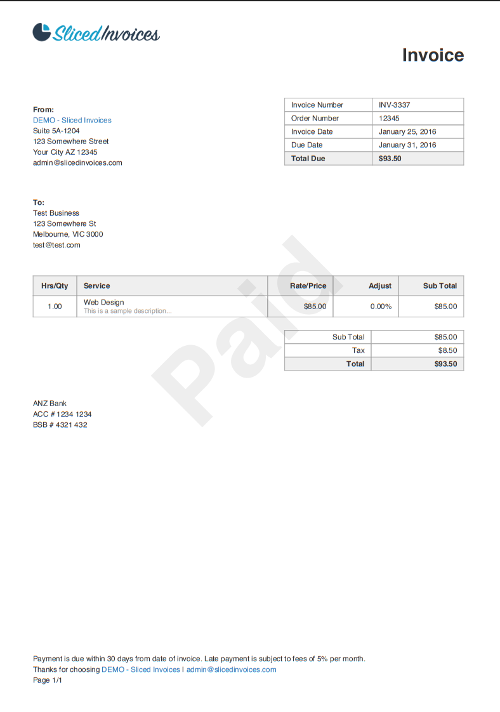

# Amazon Textract Invoice Processor

A comprehensive Python-based invoice processing system that leverages AWS Textract for intelligent document analysis and data extraction from PDF invoices.

## 🚀 Features

- **Advanced PDF Processing**: Full AWS Textract integration with all feature types
- **Smart Data Extraction**: Intelligent parsing of invoice numbers, dates, line items, totals, and payment terms
- **Multi-Format Output**: Generates detailed markdown reports and structured JSON data
- **Duplicate Detection**: MD5 hash-based change detection to prevent redundant processing
- **Multi-Currency Support**: Handles €, $, £, ¥, ₹ with intelligent parsing
- **Parallel Processing**: Concurrent document processing for optimal performance
- **Modular Architecture**: Clean, maintainable codebase with separation of concerns

## 📋 Prerequisites

- Python 3.10+ with conda/mamba package management
- AWS Account with Textract service enabled
- AWS CLI configured with appropriate permissions
- PDF invoices to process (text-based PDFs work best)

## 🛠 Installation

### 1. Clone and Setup Environment

```bash
# Clone the repository
git clone https://github.com/VisalChathuranga/Amazon-Textract-Invoice-PDF-Processor.git
cd amazon-textract-invoice-processor

# Create and activate conda environment
conda create -n invoice-textract-processor python=3.10
conda activate invoice-textract-processor

# Install dependencies
pip install -r requirements.txt
```

### 2. AWS Configuration

```bash
# Configure AWS credentials
aws configure

# Required permissions for your AWS user/role:
# - textract:StartDocumentAnalysis
# - textract:GetDocumentAnalysis  
# - s3:PutObject, s3:GetObject, s3:DeleteObject, s3:ListBucket
```

## ⚙️ Configuration

Update the configuration in `main.py`:

```python
# Configuration
FOLDER_PATH = "invoices"              # Local directory for PDF files
S3_BUCKET_NAME = "your-bucket-name"   # Your S3 bucket name
S3_PREFIX = "invoices/"               # S3 folder prefix
OUTPUT_DIR = "textract_output"        # Output directory for results
AWS_REGION = "us-east-1"              # AWS region
MAX_PARALLEL = 3                      # Concurrent processing jobs
```

## 📁 Project Structure

```text
amazon-textract-invoice-processor/
├── invoice_processor.py            #Alternative driver Script(Complete Code)  
├── main.py                         # Main driver script
├── requirements.txt                # Python dependencies
├── invoices/                       # Input directory for PDF files
├── textract_output/                # Processing results
│   ├── final_outputs/              # Structured JSON data
│   ├── *_report.md                 # Detailed markdown reports
│   └── SUMMARY_REPORT.md           # Batch processing summary
└── textract_modules/               # Modular processing components
    ├── __init__.py                 # Package initialization
    ├── config.py                   # Constants and patterns
    ├── utils.py                    # Helper functions and parsers
    ├── s3_sync.py                  # S3 synchronization
    ├── textract_client.py          # AWS Textract integration
    └── formatters.py               # Report generation
```

## 🚀 Usage

### 1. Prepare Your Invoices

```bash
mkdir invoices
# Copy your PDF invoice files to the invoices/ directory
```

### 2. Run the Processor

```bash
python main.py
```
or 
```bash
python invoice_processor.py
```


## 📊 Input vs Output Comparison

See the transformation power of AWS Textract with real examples:

### Original PDF Invoice (`invoices/invoice_03.pdf`)


### Processed JSON Output (`textract_output/final_outputs/invoice 03_extracted.json`)

The system extracts and structures the data into clean, machine-readable JSON:


```json
{
  "InvoiceNumber": "INV-3337",
  "InvoiceDate": "January 25, 2016",
  "LineItems": [
    {
      "Quantity": 1.0,
      "Description": "Web Design This is a sample description.",
      "UnitPrice": {
        "value": 85.0,
        "currency": "$",
        "formatted": "$ 85.00"
      },
      "Amount": {
        "value": 85.0,
        "currency": "$",
        "formatted": "$ 85.00"
      }
    }
  ],
  "InvoiceTotal": {
    "value": 93.5,
    "currency": "$",
    "formatted": "$ 93.50"
  },
  "PaymentTerms": "Late payment is subject to fees of 5% per month."
}
```
**Detailed Markdown Reports** for each document with:
- Document structure analysis
- Form field extraction
- Table data in markdown format
- Custom query answers
- Signature detection results
- Processing metadata and confidence scores

**Batch Summary Report** with processing statistics

## 🔧 Modular Architecture

The system is organized into specialized modules:

### `textract_modules/config.py`
- **Purpose**: Centralized configuration and patterns
- **Contains**: Regex patterns, currency symbols, header mappings, keyword lists
- **Usage**: Defines all constants for invoice field detection and parsing

### `textract_modules/utils.py`
- **Purpose**: Utility functions and parsers
- **Features**: Currency cleaning, invoice number detection, total amount finding
- **Algorithms**: Multi-strategy field detection with priority scoring

### `textract_modules/s3_sync.py`
- **Purpose**: S3 synchronization management
- **Features**: MD5 hash-based change detection, bidirectional sync
- **Operations**: Upload new/modified files, skip unchanged, delete orphaned files

### `textract_modules/textract_client.py`
- **Purpose**: AWS Textract integration core
- **Capabilities**: Layout analysis, forms extraction, table processing, query handling
- **Processing**: Async job management, block processing, result aggregation

### `textract_modules/formatters.py`
- **Purpose**: Report generation and formatting
- **Outputs**: Detailed markdown reports, batch summaries, structured data
- **Features**: Table formatting, confidence scoring, metadata presentation

## 🎯 Extracted Data Types

### 1. Layout Analysis
- Titles, headers, and section headers
- Paragraphs and text content with confidence scores
- Lists, page numbers, and footers
- Figure areas and key-value regions

### 2. Forms Data
- Key-value pairs from form fields
- Field labels and extracted values
- Confidence scoring for data quality

### 3. Table Extraction
- Complete table structure detection
- Row and column identification
- Cell content extraction with formatting
- Multi-page table support

### 4. Custom Queries
Pre-configured invoice-specific questions:
- Invoice numbers, dates, and totals
- Vendor and customer information
- Payment terms and due dates
- Tax amounts and line item details

### 5. Signature Detection
- Signature presence and location
- Confidence scoring for signature validity
- Page-level signature mapping

## ⚡ Performance Features

- **Parallel Processing**: Configurable concurrent job processing
- **Smart Caching**: MD5 hash-based duplicate detection
- **Incremental Processing**: Only processes changed files
- **Memory Efficient**: Stream-based processing for large documents

## 💡 Customization

### Modify Custom Queries

```python
custom_queries = [
    "What is the purchase order number?",
    "What is the shipping address?",
    "What are the payment instructions?",
    "What is the tax identification number?"
]
```

### Adjust Feature Toggles

```python
# Enable/disable specific Textract features
enable_layout=True      # Document structure analysis
enable_forms=True       # Form field extraction  
enable_tables=True      # Table data processing
enable_queries=True     # Custom query processing
enable_signatures=True  # Signature detection
```

### Configure Parallel Processing

```python
max_parallel=5  # Increase for better performance (consider AWS limits)
```

## 🐛 Troubleshooting

### Common Issues

**AWS Credentials**
```bash
# Verify AWS configuration
aws sts get-caller-identity
```

**S3 Bucket Permissions**
- Ensure bucket exists and is accessible
- Verify IAM policies include required S3 actions

**Textract Service Limits**
- Monitor AWS Textract service quotas
- Implement retry logic for rate limiting

## 💰 Cost Considerations

- **AWS Textract**: Pricing per page processed
- **S3 Storage**: Temporary storage costs during processing
- **Data Transfer**: S3 operation costs
- **Optimization**: Batch processing and incremental updates reduce costs

## 🤝 Contributing

1. Fork the repository
2. Create a feature branch: `git checkout -b feature/amazing-feature`
3. Test with various invoice formats
4. Submit a pull request with comprehensive testing
